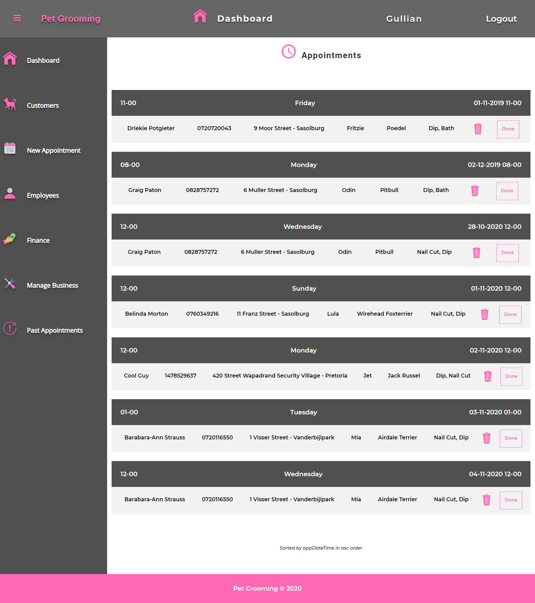

# Pet-Grooming

BSC IT Level 3 - Pearson Pretoria 

ITSP300 Project

Spring Boot + Thymeleaf + MySQL Full Stack Web Application

This application is used to manage the business operation of a mobile pet grooming business. 

